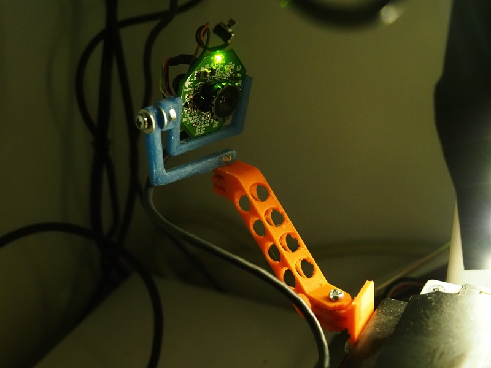
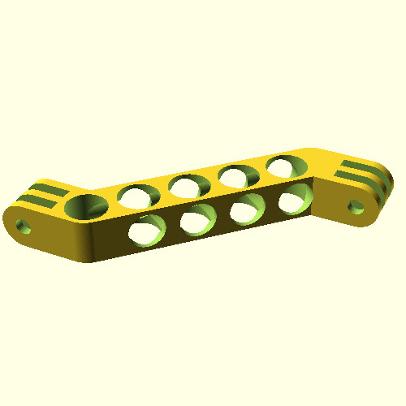
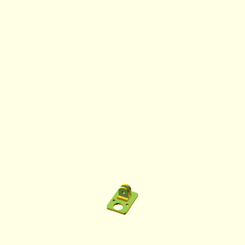
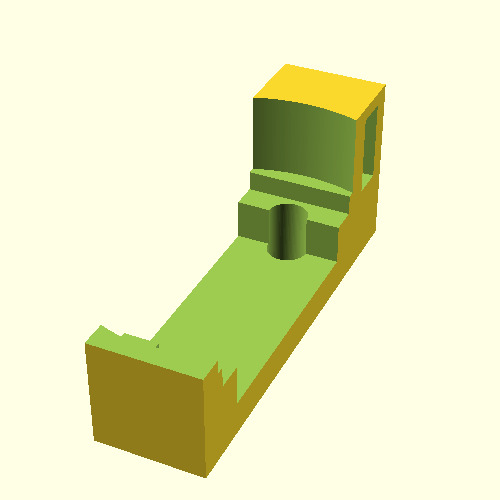
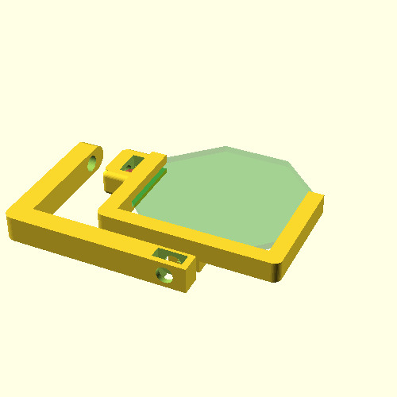
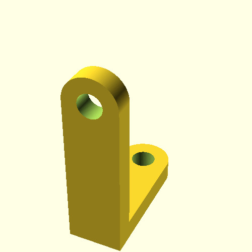

# Parametric [Webcam] Arm [for Monoprice Select Mini]

## Parts

### Arm

#### Parameters

Adjust parameters *length* and *angle* in **arm.scad** to suite your needs.

### BedMount

### Camconnector

This connector is designed to hold the webcam-pcb of a [USB-missile launcher](https://www.getdigital.eu/Webcam-USB-Missile-Launcher.html).

### Camconnector Logitech

This connector is designed to hold the webcam-pcb of an old logitech web cam.

### Gimbal

Gimbal for the camconnector

## Nuts & Screw

The assembly uses M3 nuts & screws for all connextions.
